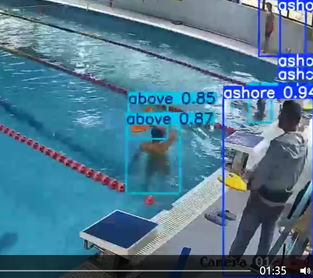
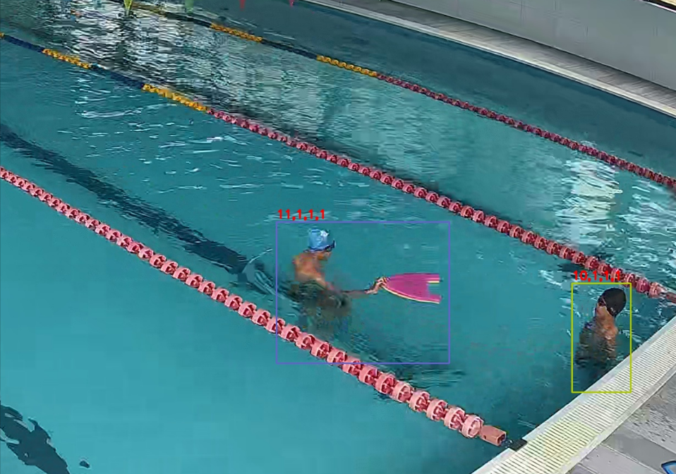

1. - [x] 标注规则：
    对每个视频进行标注，其中，每一帧标注三个类别，分别是岸上的人（0），水上的人（1）和水下的人（2），并生成对应ID。一共有两个置信度，一个是box框的置信度，表示这个box内的人是否可见，完全可见为1，如果人被完全遮挡则置信度为0。另一个置信度是类别的置信度，如果确信一个人在水上或者水下，则置信度为1，否则为0。
     标注软件为Labelme v5.1.1，生成每一帧的json文件。

2. - [x] 数据反馈（4000帧， 2025.04.23）

     一共 76821个label，其中岸上37483 个。

3. - [x] 标注样例：afternoon_1_0001.json

     ```
     {
       "version": "3.16.7",
       "flags": {},
       "shapes": [
         {
           "label": "1，1，1，0",
           "line_color": [
             34,
             200,
             65,
             255
           ],
           "fill_color": [
             34,
             200,
             65,
             128
           ],
           "points": [
             [
               1547.4358974358975,
               204.16666666666666
             ],
             [
               1641.6666666666665,
               335.57692307692304
             ]
           ],
           "shape_type": "rectangle",
           "flags": {}
         },
     
     ....
     
     ​      "imageHeight": 1440,
       "imageWidth": 2560
     }
     ```

     

4. - [x] 问题(2025.05.02)： 
   
    1. 部分id标注错误。（部分帧id重复，导致多目标跟踪效果评估受到影响）
   
    2. 坐标框错误（把浮板也标注进来了，导致有些浮板会单独识别为一个人）	

       <div style="text-align: center;">
         
   
       <div style="text-align: center;">
         


5. - [ ] 问题更新反馈：更新20250506泳池最新修改返回.zip
    1. - [x] 修改了id标注错误
    2. - [ ] 未查到json文件格式错误，再此预处理定位问题，应该是上次代码问题
    3. - [ ] 未修改坐标框问题，考虑用pretrain VL模型预处理，后续标注版本修改

